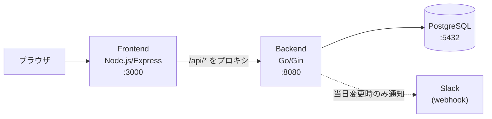

# アーキテクチャ概要

## システム概要

自宅での食事（昼・夕）の予定を家族単位で管理するWebアプリケーション。
各ユーザーが日付ごとに「なし／家／弁当」を登録し、家族全員の予定を一覧で確認できる。

## 技術スタック

| レイヤー | 技術 |
|--------|------|
| フロントエンド | Node.js 18 + Express（静的ファイル配信 + APIプロキシ） |
| クライアント | jQuery 3.6.0（SPA不使用、シンプルなDOM操作） |
| バックエンド | Go + Gin |
| データベース | PostgreSQL 17 |
| インフラ | Docker Compose |

## コンポーネント構成

フロントエンドはAPIプロキシとしても機能し、バックエンドを直接ブラウザに露出しない構成。

## 設定・環境変数

設定は `.env` ファイルで管理。`.env.example` を参照。

| 変数名 | 用途 |
|--------|------|
| `POSTGRES_USER` / `POSTGRES_PASSWORD` / `POSTGRES_DB` | DB接続情報 |
| `DATABASE_URL` | バックエンドからDB接続に使用 |
| `BACKEND_EXTERNAL_PORT` | バックエンドの公開ポート |
| `FRONTEND_EXTERNAL_PORT` | フロントエンドの公開ポート |
| `SLACK_WEBHOOK_URL` | Slack通知用（未設定時は通知しない） |
