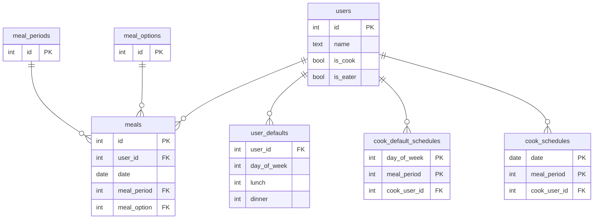

# データベース設計

## ER図

## テーブル定義

### `users`

ユーザー情報とロール属性。

| カラム | 型 | 制約 | デフォルト |
|-------|-----|------|---------|
| id | SERIAL | PK | — |
| name | TEXT | NOT NULL | — |
| is_cook | BOOL | NOT NULL | false |
| is_eater | BOOL | NOT NULL | true |

`is_cook=true` のユーザーが料理担当、`is_eater=true` のユーザーが食事予定管理の対象となる。両方 `true` も可（例: Father）。

`GET /api/meals` は `is_eater=true` のユーザーのみを返す。

---

### `meals`

ユーザーごと・日付ごと・食事区分ごとの予定。

| カラム | 型 | 制約 |
|-------|-----|------|
| id | SERIAL | PK |
| user_id | INT | FK → users, CASCADE |
| date | DATE | NOT NULL |
| meal_period | INT | FK → meal_periods |
| meal_option | INT | FK → meal_options |

UNIQUE 制約: `(user_id, date, meal_period)` — 同一ユーザー・日付・食事区分の重複登録を防止。

---

### `meal_periods`（マスタ）

食事区分の定義。

| id | 意味 |
|----|------|
| 1 | 昼食 |
| 2 | 夕食 |

---

### `meal_options`（マスタ）

食事の選択肢。

| id | 意味 |
|----|------|
| 1 | なし |
| 2 | 家 |
| 3 | 弁当 |

---

### `user_defaults`

ユーザーの曜日別デフォルト設定。`meals` にレコードがない日の表示値として使用する。

| カラム | 型 | 制約 |
|-------|-----|------|
| user_id | INT | FK → users, CASCADE |
| day_of_week | INT | 0=日〜6=土 |
| lunch | INT | meal_options の値 |
| dinner | INT | meal_options の値 |

PK: `(user_id, day_of_week)`

**設計上のポイント**

`meals` テーブルには「実際に変更した日」だけを記録する。登録のない日は `user_defaults` で補完することで、毎週同じ予定を都度入力する手間をなくしている。

---

### `cook_default_schedules`

曜日別・食事区分別の料理担当デフォルト設定。

| カラム | 型 | 制約 |
|-------|-----|------|
| day_of_week | INT | PK、0=日〜6=土 |
| meal_period | INT | PK、1=昼/2=夜 |
| cook_user_id | INT | FK → users、NULL=各自 |

登録のない曜日×区分は暗黙的に「各自」扱い。

---

### `cook_schedules`

日付別・食事区分別の料理担当個別設定。`cook_default_schedules` より優先される。

| カラム | 型 | 制約 |
|-------|-----|------|
| date | DATE | PK |
| meal_period | INT | PK、1=昼/2=夜 |
| cook_user_id | INT | FK → users、NULL=各自 |

`cook_user_id=NULL` の行は「この日は各自」を明示的に指定する。デフォルトに戻すには行を DELETE する。

**優先度：** `cook_schedules`（行あり） → `cook_default_schedules` → 各自（暗黙）
